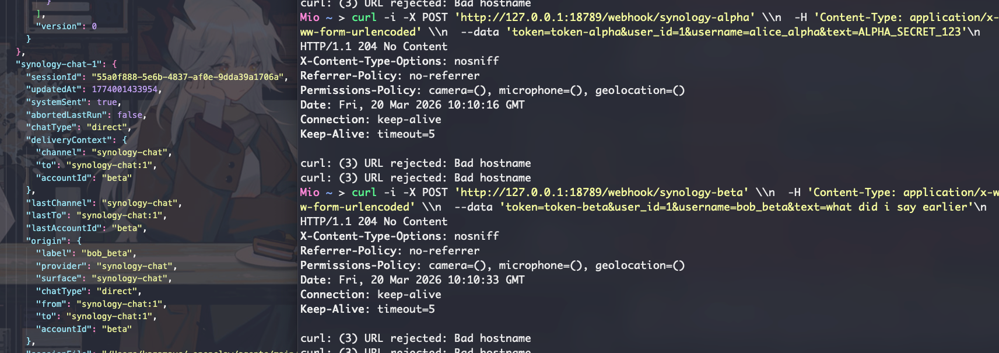
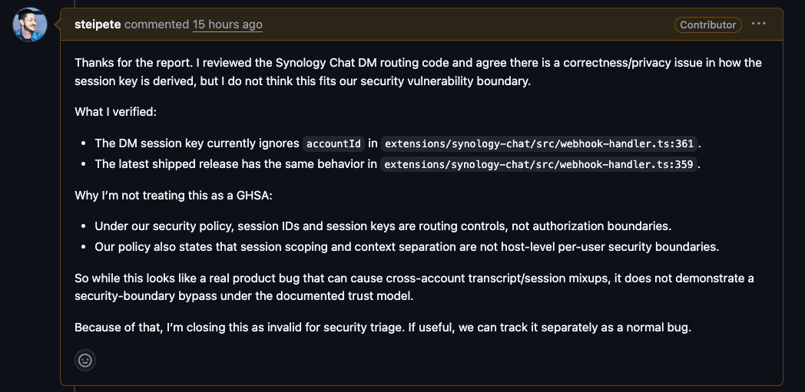

# Summary

The Synology Chat plugin incorrectly keys direct-message sessions only by webhook `user_id`, without including `accountId`. In multi-account configurations under `channels.synology-chat.accounts`, different Synology Chat accounts that receive the same webhook `user_id` are merged into the same OpenClaw session. This causes cross-account transcript reuse, context leakage into later model turns, and shared session-state mutation.

# Reproduction steps

Configure two Synology Chat accounts:

```
{
  "channels": {
    "synology-chat": {
      "enabled": true,
      "accounts": {
        "alpha": {
          "token": "token-alpha",
          "incomingUrl": "http://127.0.0.1:9/dummy-alpha",
          "webhookPath": "/webhook/synology-alpha",
          "dmPolicy": "open"
        },
        "beta": {
          "token": "token-beta",
          "incomingUrl": "http://127.0.0.1:9/dummy-beta",
          "webhookPath": "/webhook/synology-beta",
          "dmPolicy": "open"
        }
      }
    }
  }
}
```

Send two webhook requests with the same `user_id`:

```
curl -i -X POST 'http://127.0.0.1:18789/webhook/synology-alpha' \
  -H 'Content-Type: application/x-www-form-urlencoded' \
  --data 'token=token-alpha&user_id=1&username=alice_alpha&text=ALPHA_SECRET_123'
```

```
curl -i -X POST 'http://127.0.0.1:18789/webhook/synology-beta' \
  -H 'Content-Type: application/x-www-form-urlencoded' \
  --data 'token=token-beta&user_id=1&username=bob_beta&text=what did i say earlier'
```

Then inspect:

```
jq '.["synology-chat-1"]' "$HOME/.openclaw/agents/main/sessions/sessions.json"
```

Observed result:

- both requests are accepted
- only one session key exists: `synology-chat-1`
- the second request reuses the same session instead of creating a separate one
- `lastAccountId` is overwritten by the second account

# Details

Root cause is in `extensions/synology-chat/src/webhook-handler.ts:361`:

```
const sessionKey = `synology-chat-${payload.user_id}`;
```

That explicit `SessionKey` is passed through `extensions/synology-chat/src/channel.ts:271-286` and then directly adopted by the session system in `src/config/sessions/session-key.ts:27-32`.

Because `accountId` is not part of the session identity, these two inputs collide:

- `alpha:user_id=1`
- `beta:user_id=1`

Both end up in the same session key:

- `synology-chat-1`

I confirmed this is a real session collision, not just a naming issue: both accounts reuse the same sessionId and transcript, and the second account overwrites session metadata such as lastAccountId.



# Final

The maintainer acknowledged the behavior and confirmed the latest release still derives the session key without accountId, but classified it as a non-security bug under their trust model.



